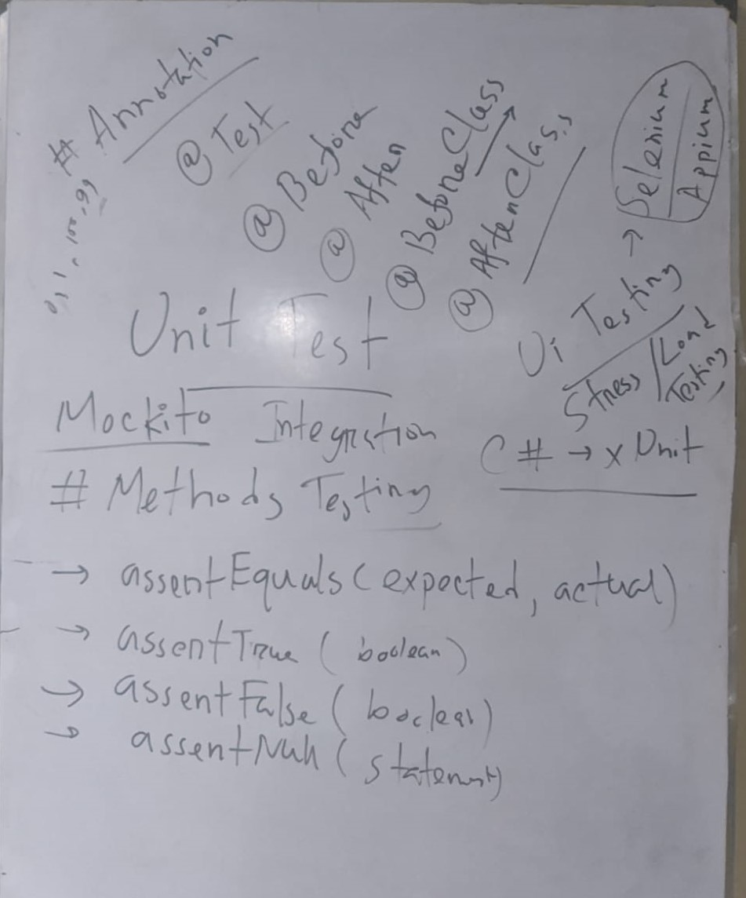

## 🍂 Theory Syllabus

- **👉Chapter 1 - 8**

## 🎅 Lab Syllabus

- **👉 Unit Testing (Java/Python)**
  - **⛑️ Unit Testing : JUNIT**
- **👉 Mockito**
- **👉 Test Automation (Framework - Selenium/Appium)**

## 🔍 Topic Covered

#### 👉 Chapter 1

- **✍️ 1.3 - Software Testing—Myths and Facts**
- **✍️ 1.4 - Goals of Software Testing**
  - **✍️ Post-implementation Goals**

#### 👉 Chapter 2

- **✍️ Difference Between Error-Bug-Failure**
- **✍️ Why error occurs?**
- **✍️ Proterties to identify test case**
- **✍️ Life cycle of a bug**
- **✍️ State of a bug**
- **✍️ Classification of bug**
- **✍️ Software testing life cycle**
- **✍️ Testing Execution Level**
  - **✍️ Regression Testing**
- **⛑️ Unit Testing : JUNIT**

#### 👉 Chapter - 3

- **✍️ Verification vs validation**
- **✍️ V-Diagram and V-Testing**
- **✍️ Figure 3.4 V&V Diagram**

#### 👉 Chapter - 4

- **✍️ Testing Category and Techniques**
- **✍️ Dynamic Testing**
- **✍️ Black Box Testing**
- **✍️ White Box Testing**
- **✍️ Boundary Value Analysis**
- **✍️ Worst Case Testing**
- **✍️ Roboustness Testing**

#### 👉 Unit Test Lab Task

- **✍️ Class diagram scenario**
- **✍️ Example : Library management system**
- **✍️ 100% test coverage**
- **✍️ Resources : [JUNIT](https://mvnrepository.com/artifact/org.junit.jupiter/junit-jupiter-api/5.10.0)**

#### 👉 Chapter - 5
- **✍️ Marked Topics From This Pdf [(Chapter - 5)](./Chapter%205%20Sir.pdf)**

#### 👉 Chapter - 6
- **✍️ Static Type Testing**
- **✍️ Inspection Process  6.1.2**
- **✍️ Glib inspection process**
- **✍️ Hwphreg process**
- **✍️ N-Fold Inspection**
- **✍️ Structured Walk-Through 6.2**
- **✍️ Technical Review**

#### 👉 Chapter - 7
- **✍️  Decomposition-Based Integration**
- **✍️ Step-by-Step Diagram**
- **✍️ Top-Down vs. Bottom-Up**
- **✍️ Call Graph Based Integration Types**
- **✍️ Path Based Integration**
- **✍️ MEP Graph - MM Path**
- **✍️ Load and Stress Testing**
- **✍️ Acceptance Testing**
- **✍️ Alpha-Beta Testing**
- **✍️ Integration Testing + Types**

#### 👉 Term Test - 1 : 1 - 5
#### 👉 Final : 1 - 7

#### 👉 Lab Final
- **✍️  Unit Testing**
- **✍️ Apache Jmeter Stress Testing and Load Testing**
- **✍️ Mockito**
- **✍️ Selenium WebDriver UI Testing**
- **✍️ Test Automation Script**

