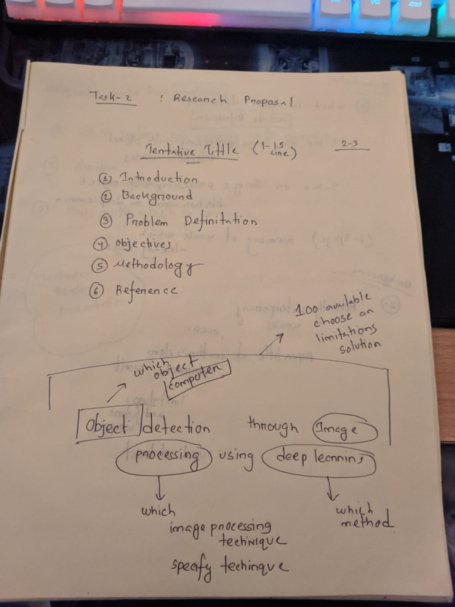

## 🔍 Tasks

- **👉 Task - 1 : Project/Research/Thesis Area**
- **👉 Task - 2 : Project Poposal 350**

## 🥶 Research Paper Publisher's

- **✍️ ACM**
- **✍️ IEEE**
- **✍️ Springer**
- **✍️ Elservier**

## 🍂 Research Paper Index

- **✍️ SCI**
- **✍️ ESCI**
- **✍️ SCIE**
- **✍️ SCOPUS**

## 🍂 Vehicle Number Plate Detection Project ([👉 Click Here](https://github.com/Sumonta056/Bangladeshi-Vehicle-Number-Plate-Detection))
#### 🍂 Task - 1 : Technical Reading : Presentation on a Research Paper

#### 🍂 Task - 2 : Technical Writing : Draft of Your Research Proposal

#### 🍂 Task - 3 : Technical Writing : Complete Proposal of Your Research

